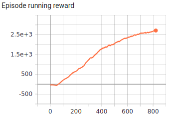
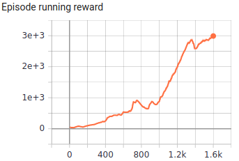

[](http://makeapullrequest.com)  
# TD3-PyTorch
TD3 (Twin Delayed Deep Deterministic Policy Gradient) is somehow the equivalent of Double Q-Learning in Continuous Domain. To avoid overestimation existed in DDPG method, a similar trick from Double Q-Learning is used: Disentangle **Action Selection** part from **Action Evaluation** in the Bellman Equation by using two separate networks.  
TD3 also uses some tricks (like **Target Policy Smoothing** ) to reduce high variance common in Policy Gradient methods.

## Demo
Ant| Hopper
:-----------------------:|:-----------------------:|
| 

## Results
> x-axis: episode number.

Ant| Hopper
:-----------------------:|:-----------------------:|
| 

## Environmnets tested
- [x] Pendulum-v0
- [x] Hopper-v2
- [x] Ant-v2
- [ ] HalfCheetah-v2   

## Dependencies
- gym == 0.17.3
- mujoco-py == 2.0.2.13
- numpy == 1.19.2
- opencv_contrib_python == 4.4.0.44
- psutil == 5.5.1
- torch == 1.6.0

## Installation
```shell
pip3 install -r requirements.txt
```
## Usage
```shell
usage: main.py [-h] [--mem_size MEM_SIZE] [--env_name ENV_NAME]
               [--interval INTERVAL] [--do_train]

Variable parameters based on the configuration of the machine or user's choice

optional arguments:
  -h, --help           show this help message and exit
  --mem_size MEM_SIZE  The memory size.
  --env_name ENV_NAME  Name of the environment.
  --interval INTERVAL  The interval specifies how often different parameters
                       should be saved and printed, counted by episodes.
  --do_train           The flag determines whether to train the agent or play
                       with it.
```
- **In order to train the agent with default arguments , execute the following command** (You may change the memory capacity and the environment based on your desire.):
```shell
python3 main.py --mem_size=700000 --env_name="Ant-v2" --do_train
```
- Remove `do_train` flag to change the mode from  _training_ to _testing_.
```shell
python3 main.py --env_name="Ant-v2" # <- Test the agent
```

## References
- [_Addressing Function Approximation Error in Actor-Critic Methods_, Fujimoto et al., 2018](https://arxiv.org/abs/1802.09477)

## Acknowledgement 
- Big thanks to [@sfujim](https://github.com/sfujim) for [TD3](https://github.com/sfujim/TD3).
